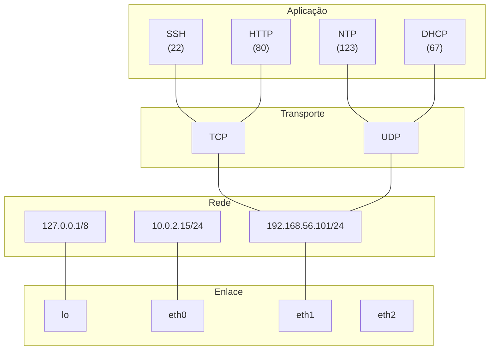

# Diagrama do TCP

```mermaid
graph BT
    subgraph Enlace
        lo
        eth0
        eth1
        eth2
    end

    subgraph Rede
        ip_lo["127.0.0.1/8"]
        ip_eth0["10.0.2.15/24"]
        ip_eth1["192.168.56.101/24"]
    end

    subgraph Transporte
        tcp["TCP"]
        udp["UDP"]
    end

    subgraph Aplicação
        ssh["SSH<br>(22)"]
        ntp["NTP<br>(123)"]
        dhcp["DHCP<br>(67)"]
        http["HTTP<br>(80)"]
    end

    lo --- ip_lo
    eth0 --- ip_eth0
    eth1 --- ip_eth1

    ip_eth1 --- tcp & udp

    tcp --- ssh & http
    udp --- ntp & dhcp
```
