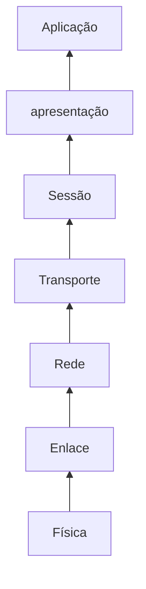

# Modelo ISO/OSI

```mermaid
graph BT
    L1["Física"]
    L2["Enlace"]
    L3["Rede"]
    L4["Transporte"]
    L5["Sessão"]
    L6["apresentação"]
    L7["Aplicação"]
    L1 --> L2 --> L3 --> L4 --> L5 --> L6 --> L7
```