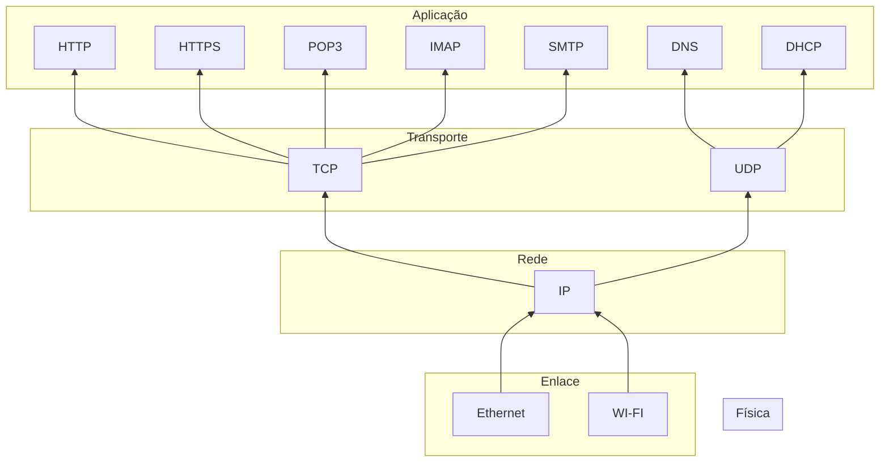

# Arquitetura TCP/IP

```mermaid
graph BT
    subgraph "Física"
    
    end

    subgraph "Enlace"
        Ethernet
        WI-FI
    end

    subgraph "Rede"
        IP
    end

    subgraph "Transporte"
        TCP
        UDP
    end

    subgraph "Aplicação"
        HTTP
        HTTPS
        DNS
        POP3
        IMAP
        SMTP
        DHCP
    end

    

    TCP --> HTTP & HTTPS & POP3 & IMAP & SMTP
    UDP --> DNS & DHCP
    IP --> TCP & UDP
    Ethernet & WI-FI --> IP
       
```